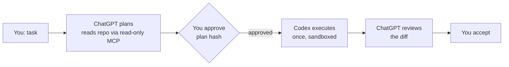

# codex++

**Let ChatGPT plan and review. Let Codex execute. One Docker container, two subscriptions working together.**

[中文说明](README.zh-CN.md) · [Operations & security details](docs/OPERATIONS.md) · MIT · Experimental

Codex quota runs out fast when it has to think *and* type. codex++ moves the thinking to the ChatGPT web app you already pay for: ChatGPT reads your project through a **read-only** MCP connector, writes the plan, and reviews the result. Codex CLI only does the approved edits. Nothing runs until you approve the exact plan.



## What's in the box

- **Codex CLI** with its own login, running in a nested sandbox (custom seccomp/AppArmor).
- **A dedicated ChatGPT Chrome** with its own profile, reachable through noVNC on `127.0.0.1` only. It starts on demand and shuts down after 30 minutes at most.
- **A read-only workspace MCP bridge**: file read/list/search and Git status/diff. Credential-like names (`.env*`, `*.pem`, `*.key`, `id_rsa`…), symlinks and hard links are refused, and Git runs on a config-free snapshot.
- **A tunnel** (Cloudflare quick tunnel by default) so ChatGPT can reach the bridge. The URL path carries the secret.
- **A task workflow**: plan → approve by SHA-256 → execute exactly once → review → manual accept. Changing the plan invalidates the approval.

## Quick start

Requirements: Linux amd64, Docker 28+, AppArmor enabled, host UID 1000, and a kernel with user namespaces and Landlock.

```bash
git clone https://github.com/martinwu0211/codex-plus-plus.git && cd codex-plus-plus

# 1. Host preparation (once)
sudo apparmor_parser -r security/codexpp.apparmor
#    A shared browser lock must exist; see docs/OPERATIONS.md before creating one.

# 2. Build
docker build -t codex-plus-plus:latest image/

# 3. Start on one project
CODEXPP_PROJECT_ROOT=/path/to/projects CODEXPP_WORKSPACE=/path/to/projects/demo ./codex++ up
./codex++ codex-login      # log Codex in (device auth)
./codex++ login            # log ChatGPT in, in the dedicated Chrome
./codex++ connect          # add the MCP connector in ChatGPT
./codex++ doctor           # health and protocol checks
```

Run a task:

```bash
./codex++ task new 'Add a --dry-run flag to the export script'   # prints a task ID
./codex++ chat start ID plan && ./codex++ chat wait ID plan
./codex++ task show-plan ID                 # read the plan and its sha256
./codex++ task approve ID --hash SHA256
./codex++ task execute ID
./codex++ chat start ID review && ./codex++ chat wait ID review
./codex++ task accept ID                    # only after you have read the review
./codex++ browser-stop
```

Each user logs in to their own Codex and ChatGPT accounts. The repository contains no login data.

## Status: experimental

Verified on the author's machine:
- separate logins;
- real MCP calls from ChatGPT;
- sandbox write boundaries;
- browser start, stop and lock release.

Not yet verified:
- a full end-to-end task accepted by a human;
- default bridge networking on a fresh machine;
- named (fixed-domain) tunnels.

ChatGPT UI automation depends on the page structure and may break when it changes.

**Use it only on a trusted host, with trusted code.** Chrome runs with `--no-sandbox` inside the container, noVNC has no password, and Codex can read the same data volume as the browser login. The full list of limits is in [docs/OPERATIONS.md](docs/OPERATIONS.md).

## Related

- [codex-web-planner](https://github.com/martinwu0211/codex-web-planner): the same plan/execute/review idea as a lightweight Codex plugin, without Docker.
- The MCP bridge design builds on [XiaoDuoYa/codex-with-chatgpt](https://github.com/XiaoDuoYa/codex-with-chatgpt); see [THIRD_PARTY.md](THIRD_PARTY.md).

## License

MIT, see [LICENSE](LICENSE). Third-party components keep their own licenses.
