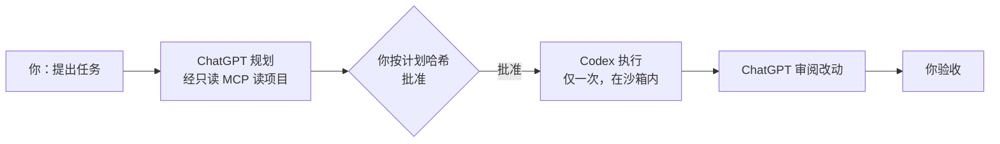

# codex++

**ChatGPT 负责规划和审阅，Codex 只负责执行。一个 Docker 容器，让两份订阅分工合作。**

[English](README.md) · [运行与安全细节](docs/OPERATIONS.md) · MIT 许可 · 实验版

Codex 既要想方案又要写代码，额度很快就会用完。codex++ 把「想」这部分交给你已经付费的 ChatGPT 网页版：ChatGPT 通过**只读** MCP 连接器读取项目，写出计划，再审阅执行结果；Codex CLI 只执行你批准过的改动。计划没经过你批准，什么都不会执行。



## 包含什么

- **Codex CLI**：单独登录，运行在嵌套沙箱里（使用专用的 seccomp/AppArmor 配置）。
- **专属 ChatGPT Chrome**：使用独立的浏览器配置，只能从本机 `127.0.0.1` 通过 noVNC 访问；需要时才启动，最多运行 30 分钟。
- **只读工作区 MCP 桥**：提供读取、列目录、搜索文件，以及 Git 状态和改动查看。像凭据的文件名（`.env*`、`*.pem`、`*.key`、`id_rsa` 等）、符号链接、硬链接一律拒绝；Git 在不带原仓库配置的快照上运行。
- **隧道**：默认用 Cloudflare 临时隧道，让 ChatGPT 能连到 MCP 桥，访问地址的路径里带着密钥。
- **任务流程**：规划 → 按计划的 SHA-256 批准 → 只执行一次 → 审阅 → 人工验收。计划一改，之前的批准就失效。

## 快速开始

环境要求：Linux amd64、Docker 28 以上、已启用 AppArmor、宿主 UID 1000，内核支持 user namespaces 和 Landlock。

```bash
git clone https://github.com/martinwu0211/codex-plus-plus.git && cd codex-plus-plus

# 1. 宿主准备（只做一次）
sudo apparmor_parser -r security/codexpp.apparmor
#    还需要一把共享浏览器锁，创建前先看 docs/OPERATIONS.md

# 2. 构建镜像
docker build -t codex-plus-plus:latest image/

# 3. 指定一个项目启动
CODEXPP_PROJECT_ROOT=/path/to/projects CODEXPP_WORKSPACE=/path/to/projects/demo ./codex++ up
./codex++ codex-login      # 登录 Codex（设备码方式）
./codex++ login            # 在专属 Chrome 里登录 ChatGPT
./codex++ connect          # 在 ChatGPT 里添加 MCP 连接器
./codex++ doctor           # 检查运行状态和协议
```

跑一个任务：

```bash
./codex++ task new '给导出脚本加一个 --dry-run 参数'   # 会输出任务编号 ID
./codex++ chat start ID plan && ./codex++ chat wait ID plan
./codex++ task show-plan ID                 # 查看计划和它的 sha256
./codex++ task approve ID --hash SHA256
./codex++ task execute ID
./codex++ chat start ID review && ./codex++ chat wait ID review
./codex++ task accept ID                    # 看完审阅意见再验收
./codex++ browser-stop
```

每个人登录自己的 Codex 和 ChatGPT 账号，仓库里不含任何登录数据。

## 现状：实验版

已在作者本机验证：
- Codex 和 ChatGPT 分别独立登录；
- ChatGPT 能真实调用 MCP；
- 沙箱的写入边界；
- 浏览器的启动、关闭和锁释放。

尚未验证：
- 一个完整任务从头到尾跑完并经人工验收；
- 在新机器上用默认 bridge 网络运行；
- 固定域名的隧道。

ChatGPT 页面的自动操作依赖页面结构，页面改版后可能失效。

**只适合在可信的宿主上运行可信的代码。** 容器里的 Chrome 以 `--no-sandbox` 运行，noVNC 没有密码，Codex 也能读到浏览器登录态所在的数据卷。完整限制见 [docs/OPERATIONS.md](docs/OPERATIONS.md)。

## 相关项目

- [codex-web-planner](https://github.com/martinwu0211/codex-web-planner)：同样是「规划 / 执行 / 审阅」的思路，做成轻量的 Codex 插件，不需要 Docker。
- MCP 桥的设计参考了 [XiaoDuoYa/codex-with-chatgpt](https://github.com/XiaoDuoYa/codex-with-chatgpt)，详见 [THIRD_PARTY.md](THIRD_PARTY.md)。

## 许可证

本项目采用 MIT 许可，见 [LICENSE](LICENSE)；第三方组件沿用各自的许可证。
